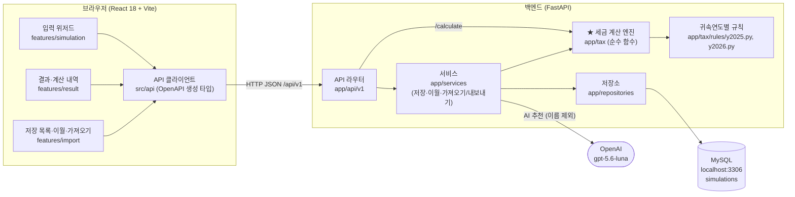

# 세금 시뮬레이터 (연말정산 · 종합소득세)

근로소득자가 예상 총급여와 공제 항목을 입력하면 최종 결정세액을 계산하고, 기납부세액과 비교해
**환급 / 추가 납부** 여부와 금액(지방소득세 포함)을 보여주는 웹 서비스입니다.

> ⚠️ 이 서비스는 **참고용 시뮬레이션**이며 실제 연말정산 결과와 다를 수 있습니다.
> 정확한 금액은 국세청 홈택스 연말정산 간소화 서비스 및 회사 정산 결과를 확인하세요.

- 상단 메뉴: **연말정산 시뮬레이터** / **종합소득세 시뮬레이터**
- 입력 방식(연말정산): **개인** 또는 **맞벌이 부부** (부양가족·의료비·교육비를 누가 공제받을지 최적 배분 추천)
- 지원 귀속연도: **2025** (검증됨), **2026** (미검증 — [알려진 제약](#알려진-제약-및-확인-필요-항목) 참고)
- 개발 규칙·도메인 상세는 [CLAUDE.md](CLAUDE.md)를 참고하세요.

---

## 목차

1. [빠른 시작](#빠른-시작)
2. [시스템 아키텍처](#시스템-아키텍처)
3. [디렉터리 구조](#디렉터리-구조)
4. [환경변수](#환경변수)
5. [개발 명령어](#개발-명령어)
6. [API](#api)
7. [세금 계산 엔진](#세금-계산-엔진)
8. [AI 추천](#ai-추천)
9. [맞벌이 부부 최적 배분](#맞벌이-부부-최적-배분)
10. [저장본과 변경안 비교](#저장본과-변경안-비교)
11. [종합소득세 시뮬레이터](#종합소득세-시뮬레이터)
12. [작년 데이터 불러오기 (연도 이월)](#작년-데이터-불러오기-연도-이월)
13. [테스트](#테스트)
14. [새 귀속연도 추가하기](#새-귀속연도-추가하기)
15. [알려진 제약 및 확인 필요 항목](#알려진-제약-및-확인-필요-항목)

---

## 빠른 시작

**사전 요구사항:** Python 3.12+, [uv](https://docs.astral.sh/uv/), Node.js 20+ (npm),
MySQL 8 이상 (`localhost:3306`에서 실행 중)

```bash
# 1. 환경변수 파일 생성 (루트의 .env 하나를 backend/frontend가 공유)
cp .env.example .env
#    → .env의 DB_HOST, DB_PORT, DB_USER, DB_PASSWORD, DB_NAME에 MySQL 접속 정보 입력

# 2. 백엔드 실행 → http://localhost:8100 (API 문서: http://localhost:8100/docs)
cd backend
uv sync
uv run python -m app.scripts.create_database   # DB가 없을 때만 (utf8mb4로 생성)
uv run python -m app                           # .env의 BACKEND_HOST/BACKEND_PORT로 실행 (--reload)
# uv run python -m app --port 8101             # 포트 직접 지정 (VITE_API_BASE_URL 포트도 같게)

# 3. 프론트엔드 실행 (새 터미널) → http://localhost:5173
cd frontend
npm install
npm run dev
```

DB 테이블(`simulations`)은 백엔드 시작 시 자동 생성됩니다.

### MySQL 준비

DB 계정이 없다면 MySQL 관리자 계정으로 한 번만 실행합니다 (계정명·비밀번호는 예시).

```sql
CREATE DATABASE IF NOT EXISTS tax_simulator CHARACTER SET utf8mb4 COLLATE utf8mb4_unicode_ci;
CREATE USER IF NOT EXISTS 'tax_simulator'@'%' IDENTIFIED BY 'change-me';
GRANT ALL PRIVILEGES ON tax_simulator.* TO 'tax_simulator'@'%';
```

> MySQL이 Docker 컨테이너에서 실행 중이면, 호스트에서 접속해도 서버에는 Docker 브리지 IP(예: `172.18.0.1`)로
> 보입니다. 그래서 `'계정'@'localhost'`로 만든 계정은 인증에 실패하므로 `'%'`(또는 `'172.18.%'`)로 만드세요.

`.env` 설정 예:

```dotenv
DB_HOST=localhost
DB_PORT=3306
DB_USER=tax_simulator
DB_PASSWORD=change-me
DB_NAME=tax_simulator
```

- 드라이버는 PyMySQL이며, MySQL 8+ 기본 인증(`caching_sha2_password`)을 위해 `cryptography`를 함께 설치합니다 (`pymysql[rsa]`).
- 한글·이모지 저장을 위해 DB·테이블·연결 모두 `utf8mb4`를 사용합니다.
- 연결 URL(`mysql+pymysql://…?charset=utf8mb4`)은 백엔드가 `DB_*` 값으로 조립합니다. 비밀번호의 특수문자도 그대로 입력하면 됩니다.
- 시각(`created_at`, `updated_at`)은 UTC로 저장하고 API는 `+00:00`을 붙여 반환합니다.

### 포트 충돌 시

다른 프로젝트가 8100·5173 포트를 이미 쓰고 있으면 요청이 엉뚱한 서버로 가거나 CORS 오류(`OPTIONS … 400 Bad Request`)가 납니다.

```bash
lsof -nP -iTCP:8100 -sTCP:LISTEN   # 포트를 쓰는 프로세스 확인
```

- **백엔드 포트를 바꿀 때:** 실행 시 `uv run python -m app --port 8101`처럼 지정하거나 `.env`의 `BACKEND_PORT`를 바꿉니다. 어느 쪽이든 프론트엔드가 호출하는 `VITE_API_BASE_URL`의 포트도 **같게** 맞추고 프론트엔드를 재시작해야 합니다.
  ```dotenv
  BACKEND_PORT=8101
  VITE_API_BASE_URL=http://localhost:8101/api/v1
  ```
- **프론트엔드 포트:** 5173이 사용 중이면 Vite가 5174 등으로 자동 변경합니다. `APP_ENV=local`에서는 백엔드가 localhost·127.0.0.1의 모든 포트를 허용하므로 따로 설정할 필요가 없습니다. `production`에서는 `CORS_ORIGINS`에 적은 Origin만 허용합니다.

---

## 시스템 아키텍처



### 계층별 책임

| 계층 | 위치 | 책임 |
|---|---|---|
| 프론트엔드 | `frontend/src` | 입력 수집, **형식·범위 검증만** (Zod), 결과 표시. **세액을 직접 계산하지 않음** |
| API | `backend/app/api/v1` | 요청/응답 스키마 검증, 라우팅, 통일된 에러 응답 |
| 서비스 | `backend/app/services` | 유스케이스: 저장, 불러오기, 연도 이월, JSON 가져오기/내보내기, 스키마 마이그레이션 |
| 저장소 | `backend/app/repositories` | SQLAlchemy를 통한 DB 접근 |
| 계산 엔진 | `backend/app/tax` | **순수 함수**. DB·HTTP·파일·현재 시각 참조 없음. 입력은 Pydantic 모델, 출력은 불변 결과 객체 |
| 규칙 | `backend/app/tax/rules` | 세율·공제율·한도·구간 경계값. 계산 로직은 규칙 객체를 주입받음 |

### 핵심 설계 원칙

- **단일 진실 공급원:** 모든 세액 계산은 백엔드 엔진에서만 수행합니다. 프론트엔드의 실시간 미리보기도
  `POST /simulations/calculate`를 호출합니다 (입력 변경 후 300ms 디바운스).
- **타입 공유:** 프론트엔드 타입은 백엔드 OpenAPI 스키마에서 `openapi-typescript`로 생성합니다
  (`frontend/src/api/schema.d.ts`). 수동으로 복제하지 않습니다.
- **금액 표현:** 원 단위 `int` 또는 `Decimal`만 사용하며 `float`는 쓰지 않습니다. 원 미만 절사 등
  끝수 처리는 단계마다 근거 조문과 함께 명시합니다.
- **설명 가능한 결과:** 모든 공제 항목은 `(적용 대상, 공제액, 한도 적용 여부, 설명)`을 담은
  계산 내역(breakdown)을 반환하고, 화면은 이를 그대로 보여줍니다.

### 요청 흐름 예시: 실시간 미리보기

```
사용자 입력 → React Hook Form → (300ms 디바운스) → Zod 형식 검증 통과
  → POST /api/v1/simulations/calculate
  → app.tax.engine.calculate(input, get_rules(tax_year))
  → TaxResult(JSON) → 미리보기 패널·결과 화면 렌더링
```

---

## 디렉터리 구조

```
.
├── .env.example              # 환경변수 템플릿 (복사해서 .env 생성)
├── CLAUDE.md                 # 개발 규칙·도메인 상세
├── README.md
├── backend/
│   ├── pyproject.toml        # uv 프로젝트, ruff·mypy·pytest 설정
│   ├── openapi.json          # 내보낸 OpenAPI 스키마 (프론트 타입 생성 입력)
│   ├── app/
│   │   ├── main.py           # FastAPI 앱 팩토리, 라우터 등록, CORS
│   │   ├── db.py             # DB 엔진·세션 (MySQL, test 환경은 인메모리 SQLite)
│   │   ├── core/             # config.py(루트 .env 로드), errors.py(통일 에러 응답)
│   │   ├── api/v1/           # simulations.py, import_export.py, rules.py
│   │   ├── schemas/          # API 요청/응답 모델
│   │   ├── models/           # SQLAlchemy ORM (Simulation)
│   │   ├── repositories/     # DB 접근
│   │   ├── services/         # simulation_service, carry_over, schema_migration, ai_recommendation, ai_couple
│   │   ├── scripts/          # export_openapi.py
│   │   └── tax/              # ★ 계산 엔진 (아래 상세)
│   └── tests/
│       ├── unit/tax/         # 공제·세액공제 항목별 단위 테스트, 속성 기반 테스트
│       ├── unit/services/    # 연도 이월, 스키마 마이그레이션, 설정
│       ├── golden/           # 사례 기반 end-to-end 계산 (cases/*.json)
│       └── api/              # TestClient 통합 테스트
└── frontend/
    ├── vite.config.ts        # envDir: '..' (루트 .env 사용), Vitest 설정
    └── src/
        ├── api/              # client.ts, types.ts, schema.d.ts(생성됨)
        ├── features/
        │   ├── start/        # 입력 방식 선택 (개인 / 맞벌이 부부)
        │   ├── simulation/   # 개인 입력 위저드, 단계별 컴포넌트, Zod 스키마, 실시간 계산 훅
        │   ├── couple/       # 맞벌이 위저드, 공유 부양가족 입력, 최적 배분 결과, AI 배분 설명
        │   ├── compare/      # 저장본 vs 변경안 비교 화면, 2건 비교 페이지, 입력 경로 라벨
        │   ├── global/       # 종합소득세: 연말정산 불러오기, 사업·기타소득 입력, 결과, 저장 목록
        │   ├── business/     # 사업자 소득관리, 지분 배분 미리보기, 공동대표 일괄 계산
        │   ├── result/       # 결과 요약, 단계별 계산, 공제 내역 트리, AI 추천 패널
        │   └── import/       # 저장 목록, 올해로 이월, JSON 가져오기/내보내기
        ├── components/       # MoneyInput, Field, StepIndicator, Disclaimer 등 공통 UI
        ├── lib/              # 금액 포맷터(format.ts), 디바운스 훅
        └── test/             # MSW 핸들러, 픽스처, 렌더 헬퍼
```

### 계산 엔진 (`backend/app/tax/`)

```
tax/
├── engine.py            # 전체 파이프라인, 특별공제 vs 표준세액공제 자동 비교
├── couple.py            # 맞벌이 부부 부양가족 배분 최적화 (모든 조합 계산)
├── compare.py           # 두 결과 비교 (지표·공제 항목·입력 차이)
├── global_income.py     # 종합소득세 (근로 + 사업 + 기타소득, 분리/종합과세 비교)
├── business.py          # 공동사업장 소득금액의 손익분배비율 배분
├── inputs.py            # 입력 모델 (SimulationInput, extra="forbid")
├── result.py            # 출력 모델 (TaxResult, BreakdownItem, CalcWarning)
├── eligibility.py       # 공제 요건 판정 (위반 시 경고로 반환)
├── money.py / tiers.py  # 절사·비율 적용·구간 계산 유틸
├── tax_rate.py          # 기본세율 (누진공제액 방식)
├── deductions/          # earned_income, personal, insurance, housing, card, venture, national_growth_fund, aggregate_limit
├── credits/             # earned_income, child, pension_account, insurance, medical, education, donation, misc(월세·표준·결혼)
└── rules/               # base.py(규칙 스키마), y2025.py, y2026.py, __init__.py(레지스트리)
```

---

## 환경변수

루트의 `.env` **하나만** 사용하며 backend와 frontend가 공유합니다. 하위 디렉터리에 `.env`를 만들지 마세요.

| 변수 | 기본값 | 설명 |
|---|---|---|
| `APP_ENV` | `local` | `local` \| `test` \| `production`. `test`면 인메모리 SQLite 사용 |
| `BACKEND_HOST` | `127.0.0.1` | 백엔드 호스트 |
| `BACKEND_PORT` | `8100` | 백엔드 포트 (`VITE_API_BASE_URL`의 포트와 같아야 함) |
| `DB_HOST` | `localhost` | MySQL 호스트 |
| `DB_PORT` | `3306` | MySQL 포트 |
| `DB_USER` | `tax_simulator` | MySQL 계정 |
| `DB_PASSWORD` | (빈 값) | MySQL 비밀번호. 특수문자 그대로 입력. **비밀값이므로 `VITE_` 금지** |
| `DB_NAME` | `tax_simulator` | 데이터베이스 이름 |
| `OPENAI_API_KEY` | (빈 값) | AI 추천용 OpenAI API 키. 없으면 AI 추천만 503으로 비활성화. **비밀값이므로 `VITE_` 금지** |
| `OPENAI_MODEL` | `gpt-5.6-luna` | AI 추천에 사용할 OpenAI 모델 |
| `OPENAI_TIMEOUT_SECONDS` | `60` | OpenAI 응답 대기 시간(초) |
| `CORS_ORIGINS` | `http://localhost:5173` | 허용 Origin (쉼표로 여러 개). `APP_ENV=local`이면 localhost 임의 포트도 추가로 허용 |
| `DEFAULT_TAX_YEAR` | `2025` | 기본 귀속연도 (지원하지 않는 연도면 최신 지원 연도 사용) |
| `VITE_API_BASE_URL` | `http://localhost:8100/api/v1` | 프론트엔드가 호출할 API 주소 |

- 백엔드는 `app/core/config.py`에서 **절대 경로**로 루트 `.env`를 읽습니다.
- 프론트엔드는 `vite.config.ts`의 `envDir`로 루트 `.env`를 읽습니다.
- `VITE_` 접두사 변수만 브라우저 번들에 노출됩니다. **비밀값에는 절대 `VITE_`를 붙이지 마세요.**
- 새 변수를 추가하면 `.env.example`에 설명과 함께 추가하세요.

---

## 개발 명령어

### Backend (`backend/` 디렉터리)

| 명령 | 설명 |
|---|---|
| `uv sync` | 의존성 설치 |
| `uv add <pkg>` / `uv add --dev <pkg>` | 패키지 추가 (pip 직접 사용 금지) |
| `uv run python -m app` | 개발 서버. `.env`의 `BACKEND_HOST`·`BACKEND_PORT` 사용, 자동 재시작 (`--no-reload`로 끄기). 문서 `/docs` |
| `uv run python -m app --port 8101 [--host 0.0.0.0]` | 포트·호스트를 직접 지정해 실행 (`-p`로 줄여 쓰기 가능, `.env` 값보다 우선) |
| `uv run pytest` | 전체 테스트 |
| `uv run pytest tests/unit/tax -q` | 계산 엔진 테스트만 |
| `uv run pytest tests/golden -q` | 골든 사례 테스트만 |
| `uv run pytest --cov=app/tax --cov-report=term-missing` | 엔진 커버리지 |
| `uv run ruff check . && uv run ruff format .` | 린트 + 포맷 |
| `uv run mypy app` | 타입 검사 (strict) |
| `uv run python -m app.scripts.export_openapi` | `backend/openapi.json` 갱신 |
| `uv run python -m app.scripts.create_database` | `.env`의 MySQL DB가 없으면 utf8mb4로 생성 |
| `MYSQL_TEST_DB_NAME=tax_simulator_test uv run pytest tests/integration` | 실제 MySQL 통합 테스트 (`.env` 접속 정보 + 전용 테스트 DB) |

### Frontend (`frontend/` 디렉터리)

| 명령 | 설명 |
|---|---|
| `npm install` | 의존성 설치 |
| `npm run dev` | 개발 서버 (http://localhost:5173) |
| `npm run test` | Vitest 1회 실행 (`npm run test:watch`: 감시 모드) |
| `npm run lint` | ESLint |
| `npm run typecheck` | `tsc --noEmit` |
| `npm run format` / `npm run format:check` | Prettier |
| `npm run build` | 프로덕션 빌드 (`dist/`) |
| `npm run gen:api` | `../backend/openapi.json` → `src/api/schema.d.ts` 타입 생성 |

### API 스키마를 바꿨을 때

백엔드의 `app/schemas/` 또는 `app/tax/inputs.py`·`result.py`·`rules/base.py`를 수정했다면:

```bash
cd backend  && uv run python -m app.scripts.export_openapi
cd frontend && npm run gen:api && npm run typecheck
```

폼 스키마(`features/simulation/schema.ts`)가 API 타입과 어긋나면 `typecheck`가 실패합니다.

### 작업 완료 전 체크리스트

```bash
cd backend  && uv run pytest && uv run ruff check . && uv run mypy app
cd frontend && npm run test && npm run typecheck && npm run lint
```

---

## API

모든 엔드포인트는 `/api/v1` 접두사를 사용합니다. 대화형 문서: http://localhost:8100/docs

| 메서드 | 경로 | 설명 |
|---|---|---|
| `POST` | `/simulations/calculate` | 저장 없이 계산만 (실시간 미리보기용) |
| `POST` | `/simulations` | 시뮬레이션 저장 (`{name, input}`, 결과 스냅샷 함께 저장) |
| `GET` | `/simulations?tax_year=YYYY` | 목록 (귀속연도 필터 선택) |
| `GET` | `/simulations/{id}` | 상세 (입력 + 결과) |
| `PUT` | `/simulations/{id}` | 수정 (재계산) |
| `DELETE` | `/simulations/{id}` | 삭제 |
| `POST` | `/simulations/{id}/compare` | 저장본(기준)과 변경안 입력 비교 (저장하지 않음) |
| `POST` | `/simulations/{id}/carry-over?target_year=YYYY&salary_increase_rate=3.5` | 작년 데이터로 올해 초안 생성 |
| `GET` | `/simulations/{id}/export` | JSON 파일로 내보내기 |
| `POST` | `/simulations/import?target_year=YYYY` | JSON 가져오기 (`target_year` 지정 시 연도 이월 변환) |
| `POST` | `/recommendations` | AI 추천: 추가로 받을 수 있는 공제 항목 (예상 절세액은 계산 엔진이 산출) |
| `POST` | `/couples/optimize` | 맞벌이 부부 부양가족·의료비·교육비 최적 배분 (모든 조합을 엔진으로 계산) |
| `POST` | `/couples/recommendations` | 맞벌이 최적 배분에 대한 AI 설명과 부부 절세 팁 |
| `POST` | `/global-income/calculate` | 종합소득세 계산 (근로 + 사업 + 기타소득, 저장하지 않음) |
| `POST`·`GET` | `/global-income/simulations` | 종합소득세 시뮬레이션 저장(`source_simulation_id`로 연말정산 연결) / 목록 |
| `GET`·`PUT`·`DELETE` | `/global-income/simulations/{id}` | 종합소득세 시뮬레이션 조회·수정·삭제 |
| `POST` | `/businesses/allocate` | 사업장 소득금액을 손익분배비율대로 배분 (저장하지 않음) |
| `POST` | `/businesses/partnership` | 공동대표 일괄 종합소득세 (각자의 연말정산 결과 + 지분만큼의 사업소득) |
| `POST`·`GET` | `/businesses` | 사업자 등록 / 목록 |
| `GET`·`PUT`·`DELETE` | `/businesses/{id}` | 사업자 조회·수정·삭제 |
| `GET` | `/rules` | 지원 귀속연도 목록, 기본 연도 |
| `GET` | `/rules/{tax_year}` | 해당 연도 한도·공제율 메타데이터 (입력 안내문 표시용) |
| `GET` | `/health` | 헬스 체크 (접두사 없음) |

### 에러 응답 형식

```json
{ "code": "unsupported_tax_year", "message": "지원하지 않는 귀속연도입니다: 2019", "details": { "tax_year": 2019, "supported_years": [2025, 2026] } }
```

| code | HTTP | 상황 |
|---|---|---|
| `validation_error` | 422 | 요청 형식·범위 오류, 알 수 없는 필드 |
| `not_found` | 404 | 시뮬레이션·경로 없음 |
| `unsupported_tax_year` | 400 | 규칙이 없는 귀속연도 |
| `invalid_carry_over` | 400 | 이월 대상 연도가 원본보다 이전·같음 |
| `unsupported_schema_version` | 400 | 가져온 JSON의 스키마 버전 미지원 |
| `invalid_import` | 400/422 | 가져온 JSON의 입력값 오류, 연도 불일치 |
| `ai_unavailable` | 503 | `OPENAI_API_KEY` 미설정 |
| `ai_failed` | 502 | OpenAI 호출 실패·시간 초과·응답 해석 실패 |

---

## 세금 계산 엔진

### 계산 파이프라인

```
총급여 (= 연간 근로소득 − 비과세소득)
 − 근로소득공제                         → 근로소득금액
 − 소득공제 (인적·연금보험료·특별소득·그 밖의 공제[주택청약·신용카드·벤처투자·국민성장펀드], 종합한도 2,500만원)
 = 과세표준
 × 기본세율 (8단계 누진, 누진공제액 방식)  → 산출세액
 − 세액공제 (근로소득·자녀·연금계좌·특별세액공제/표준세액공제·기부금·월세·결혼)
 = 결정세액 (0원 하한, 세액공제 합계는 산출세액을 넘지 않음)
 − 기납부세액                            → 차감징수세액 (음수 = 환급, 10원 미만 절사)
 + 지방소득세 (결정세액의 10%)
```

### 특별공제 vs 표준세액공제

엔진이 두 방식을 모두 계산해 **결정세액이 적은 쪽을 자동 적용**하고, 결과의 `method_comparison`에
두 방식 결과를 함께 담습니다.

- **특별공제 방식:** 특별소득공제(건강·고용보험, 주택자금) + 특별세액공제(보험·의료·교육·특례/일반기부금) + 월세
- **표준세액공제 방식:** 위 항목 제외 + 표준세액공제 13만원 (정치자금·고향사랑기부금 등은 유지)

### 요건 판정과 경고

부양가족 나이·소득 요건, 무주택 요건, 총급여 한도 등은 `eligibility.py`에서 계산과 분리해 판정합니다.
요건을 충족하지 못한 항목은 계산에서 제외되고, **오류가 아닌 경고(`warnings`)**로 결과에 포함됩니다.

---

## AI 추천

결과 화면 우측 패널에서 「AI 추천 받기」를 누르면, 추가로 받을 수 있는 공제 항목을 OpenAI(`OPENAI_MODEL`, 기본 `gpt-5.6-luna`)가 추천합니다.

```
현재 입력 → POST /api/v1/recommendations
  → 계산 엔진으로 현재 결과 산출
  → OpenAI(구조화 출력): 추천 항목 + 금액 조정 제안 (예: IRP +300만원)
  → 제안을 입력에 반영해 계산 엔진으로 재계산 → 예상 절세액 = 현재 − 재계산 (지방소득세 포함)
  → 효과 없는 제안 제외, 절세액 순 정렬 → 화면 표시
```

- **절세액은 AI가 계산하지 않습니다.** AI는 무엇을 얼마나 늘릴지만 제안하고, 금액은 계산 엔진이 산출합니다 (단일 진실 공급원 유지).
- AI가 조정할 수 있는 항목은 `app/schemas/recommendation.py`의 `ADJUSTABLE_FIELDS`로 제한됩니다. 카드 결제수단(체크카드·전통시장 등) 조정은 총 사용액은 그대로 두고 신용카드 사용분을 옮기는 것으로 계산합니다.
- 「적용해 보기」로 추천을 폼에 반영해 결과를 다시 볼 수 있고, 「되돌리기」로 원래 입력으로 돌아갑니다.
- **개인정보:** 버튼을 눌렀을 때만 전송하며, 부양가족·교육비 대상자 이름은 지우고 보냅니다. 출생연도 대신 나이를 보냅니다. OpenAI 요청은 `store=False`로 보냅니다.
- `OPENAI_API_KEY`가 없으면 이 기능만 503(`ai_unavailable`)을 반환하고 나머지 기능은 정상 동작합니다.

---

## 맞벌이 부부 최적 배분

첫 화면에서 **맞벌이 부부**를 고르면 부부 각자의 급여·공제를 입력한 뒤, 함께 부양하는 가족을 누가 공제받는 것이
유리한지 계산합니다.

```
귀속연도 → 본인 정보·공제 → 배우자 정보·공제 → 부양가족 배분(가족별 의료비·교육비, 현재 배정) → 결과
```

- **배분 단위:** 세법상 부양가족 1명은 부부 중 한 사람만 기본공제를 받을 수 있고, 그 가족의 의료비·교육비 공제와
  자녀세액공제도 기본공제를 받는 사람에게 따라갑니다. 그래서 "부양가족 + 그 가족의 의료비·교육비"를 한 단위로 배분합니다.
- **최적화는 계산 엔진이 수행합니다** (`app/tax/couple.py`, 순수 함수). 가능한 모든 배분(부양가족 N명 → 2^N가지, 최대 10명)을
  엔진으로 계산해 **부부 합산 세부담(지방소득세 포함)이 가장 적은 안**을 고릅니다. 효과가 같으면 현재 배분을 유지합니다.
- 부양가족 의료비는 나이·장애 여부로 한도 없는 의료비(65세 이상·과세기간 개시일 현재 6세 이하·장애인)와 그 밖의 의료비로
  자동 분류합니다 (연령 기준은 규칙 파일 값).
- 본인 몫(본인 의료비·교육비, 카드, 연금계좌 등)은 각자의 공제 단계에 입력합니다.
- **저장된 개인 시뮬레이션에서 불러오기:** 「본인 정보」·「배우자 정보」 단계에서 저장해 둔 개인 시뮬레이션을 골라 불러올 수 있습니다
  (기본은 같은 귀속연도만 표시, 「다른 귀속연도도 보기」 선택 가능).
  - 급여·기납부세액·본인 정보·공제 입력은 그 사람의 입력으로 옮기고 「배우자 있음」을 켭니다.
  - 부양가족은 「부양가족 배분」 목록으로 옮기며 현재 공제자는 불러온 사람으로 둡니다. 배우자 관계는 제외하고,
    부부 양쪽에 같은 가족(이름·관계·출생연도 동일)이 있으면 한 번만 추가합니다.
  - 교육비는 대상자 이름이 부양가족과 같으면 그 가족에게 옮기고, 본인·대상 불명 교육비는 개인 몫에 남깁니다.
  - 의료비는 합계만 저장되어 가족별로 나눌 수 없으므로 개인 몫에 남기고 안내합니다.
  - 변환 로직: `frontend/src/features/couple/importIndividual.ts` (입력 재배치만 수행, 세액 계산 없음)
- 결과 화면: 현재 vs 추천 배분 비교, 가족별 추천 대상(변경 표시), 다른 배분안, 부부 각자의 상세 계산.
  「추천 배분을 현재 배분으로 적용」, 「추천 배분으로 각자 저장」(시뮬레이션 2건 저장)을 지원합니다.
- **AI 배분 설명** (우측 패널, 버튼을 눌렀을 때만): 엔진이 정한 배분이 왜 유리한지(한계세율, 의료비 문턱 3% 차이 등)와
  부부 절세 팁을 OpenAI가 설명합니다. AI는 배분이나 세액을 바꾸지 않으며, 이름은 지우고 index로만 보냅니다.

---

## 저장본과 변경안 비교

저장한 시뮬레이션을 기준으로, 입력을 바꾸면 결과가 어떻게 달라지는지 비교합니다. 비교는 저장하지 않고 계산만 합니다.

- **수정 중 실시간 표시:** 저장된 시뮬레이션을 열어 입력을 바꾸면 미리보기에 「저장본 대비 N원 유리/불리 (입력 n개 변경)」가 표시됩니다.
- **결과 단계 「저장본과 비교」 탭:** 유리·불리 요약(지방소득세 포함), 주요 지표(총급여 → 과세표준 → 결정세액 → 정산 결과)의
  전후·차이, 바뀐 입력 목록(예: `퇴직연금(IRP) 0원 → 3,000,000원`), 바뀐 소득공제·세액공제 항목.
- **「새 항목으로 저장」:** 원본은 그대로 두고 변경안을 새 시뮬레이션으로 저장합니다 (「변경 저장」은 원본을 덮어씀).
- **저장 목록에서 2건 비교:** 체크박스로 두 건을 고르면 `/compare/{기준}/{비교 대상}` 화면에서 비교합니다
  (예: 2025년 저장본 vs 2026년 이월 초안. 귀속연도가 다르면 세법 규칙 차이도 함께 반영됨을 안내).
- **기준 결과는 현재 규칙으로 다시 계산**합니다. 저장 당시 결과 스냅샷과 다르면(세법 규칙 변경 등) 그 사실을 표시해, 입력 변경
  효과와 규칙 변경 효과가 섞이지 않게 합니다.
- 비교 로직은 순수 함수(`app/tax/compare.py`)이며, 차이는 모두 계산 엔진 결과끼리의 차이입니다.

---

## 종합소득세 시뮬레이터

상단 「종합소득세 시뮬레이터」 메뉴에서 근로소득에 **사업소득·기타소득**을 더해 5월 종합소득세 신고 때 납부(환급)할 세액을 계산합니다.

```
연말정산 불러오기(또는 새로 입력) → 기본 정보 → 부양가족 → 공제 → 사업·기타 소득 → 결과(저장)
```

- **연말정산 결과 불러오기:** 저장해 둔 개인 연말정산 시뮬레이션을 고르면 급여·부양가족·공제 입력을 그대로 가져옵니다.
  불러올 결과가 없으면 「새로 입력하기」로 시작합니다 (근로소득이 없으면 급여 0원).
- **사업소득** (여러 건): 총수입금액 − 필요경비. 필요경비는 장부(실제 경비) 또는 경비율(홈택스 업종별 단순·기준경비율을 사용자가 입력).
  원천징수세액을 비워 두면 총수입금액 × 3%로 추정. 결손이면 다른 종합소득에서 차감(이월공제는 미지원).
- **기타소득** (여러 건): 강연료·원고료 등은 필요경비 60% 의제(실제 경비가 더 크면 실제), 그 밖은 실제 경비.
  원천징수세액을 비워 두면 기타소득금액 × 20%로 추정. 기타소득금액 합계가 300만원 이하면 **분리과세(20%, 과세 종결)와 종합과세 중
  유리한 쪽을 자동 선택**하고 두 방식의 세부담을 비교해 보여줍니다.
- **기납부세액** = 근로소득 연말정산 결정세액(직접 입력 가능) + 사업소득 원천징수 + (종합과세 시) 기타소득 원천징수 + 중간예납.
- **계산 엔진 재사용:** 연말정산 엔진에 "그 밖의 종합소득금액"을 넘겨 계산합니다 (`calculate(..., extra_income=...)`).
  - 과세표준은 종합소득금액 기준, 벤처투자·기부금 한도와 부녀자공제 소득 요건도 종합소득금액 기준
  - 근로소득세액공제는 산출세액 × 근로소득금액 / 종합소득금액에만 적용 (소득세법 제59조)
  - 근로소득이 없으면 특별소득공제·신용카드 등 소득공제·보험료·의료비·교육비·월세 세액공제를 제외하고 표준세액공제 7만원
  - 연금계좌 세액공제율은 근로소득 외 소득이 있으면 종합소득금액 4,500만원 기준
  - 근로소득만 있을 때(연말정산)는 결과가 이전과 동일 (회귀 테스트로 보장)
- **사업자 소득관리** (상단 보조 메뉴 「사업자 관리」): 사업장별 총수입·필요경비(장부/경비율)·원천징수와 **공동대표 지분**
  (예: 5:5, 6:4 → 지분 5·5, 6·4)을 저장하고, 각 대표에 그 사람의 연말정산 시뮬레이션을 연결합니다.
  - 공동사업장은 사업장 단위로 소득금액을 계산한 뒤 손익분배비율대로 나눕니다 (소득세법 제43조). 원천징수세액도 같은 비율.
    각 금액은 지분대로 원 미만 절사해 나누고 끝수는 마지막 대표에게 배정해 합계가 항상 일치합니다 (`app/tax/business.py`).
  - 종합소득세 입력의 「사업·기타 소득」 단계에서 **사업자 관리에서 불러오기 → 사업자·본인 대표 선택**으로 지분만큼의 사업소득을 추가합니다.
  - **공동대표 일괄 계산:** 대표마다 연결된 연말정산 결과(근로소득·공제, 기납부 = 연말정산 결정세액)와 지분만큼의 사업소득으로
    각자의 종합소득세를 계산해 나란히 보여주고, 합계와 「대표별 종합소득세로 각각 저장」을 제공합니다.
    연말정산이 연결되지 않은 대표는 근로소득 없이(본인 기본공제만) 계산하고 안내합니다.
- 저장: 별도 테이블 `global_income_simulations`, `businesses` (불러온 연말정산 시뮬레이션과 연결, 원본 삭제 시 연결만 해제).
- 코드: `backend/app/tax/global_income.py`, `backend/app/api/v1/global_income.py`, `frontend/src/features/global/`

---

## 작년 데이터 불러오기 (연도 이월)

두 가지 경로를 제공합니다.

1. **저장된 시뮬레이션에서 불러오기:** 목록에서 전년도 건의 「올해로 이월」 선택
2. **JSON 파일 가져오기/내보내기:** 내보낸 파일을 가져오면서 변환할 귀속연도 선택

이월 변환(`app/services/carry_over.py`)은 다음을 수행합니다.

- **원본은 변경하지 않고** 새 시뮬레이션 초안을 생성 (`source_simulation_id`로 연결)
- 부양가족은 출생연도로 저장되므로 나이가 자동 +1 → 경로우대(70세)·자녀세액공제(8세)·기본공제 나이 요건 재판정 결과를 경고로 안내
- 해당 연도에만 적용되는 항목(출산·입양, 결혼세액공제) 초기화
- 선택 시 급여 인상률(-50% ~ 100%) 일괄 적용
- 연도 간 사라지거나 새로 생긴 항목은 `FIELD_MAPPINGS` 매핑 테이블로 처리, 매핑 불가 항목은 경고

가져오는 JSON은 `schema_version`을 검사하고, 구버전은 `app/services/schema_migration.py`의
마이그레이션 함수 체인으로 변환합니다. 알 수 없는 필드는 거부합니다. (현재 스키마 버전: `1`)

---

## 테스트

| 종류 | 위치 | 내용 |
|---|---|---|
| 단위 | `backend/tests/unit/tax/` | 항목별 구간 경계값(바로 아래/정확히/바로 위), 한도 도달·초과, 0원, 최저사용금액 미달, 결정세액 0원 하한 |
| 속성 기반 | `backend/tests/unit/tax/test_properties.py` | Hypothesis: 총급여 증가 시 세액 비감소, 공제 입력 증가 시 세액 비증가 등 |
| 골든 | `backend/tests/golden/cases/*.json` | 입력 + 기대 결과 + 출처를 담은 end-to-end 사례 |
| 서비스 | `backend/tests/unit/services/` | 연도 이월, 매핑 테이블, 스키마 마이그레이션, 설정 |
| API | `backend/tests/api/` | TestClient + 인메모리 SQLite (`APP_ENV=test`) |
| MySQL 통합 | `backend/tests/integration/` | 실제 MySQL에서 CRUD·이월·utf8mb4·UTC 시각 확인. `MYSQL_TEST_DB_NAME`(전용 테스트 DB, `DB_NAME`과 달라야 함) 지정 시에만 실행, 테이블을 만들고 삭제함 |
| 프론트 | `frontend/src/**/*.test.ts(x)` | 금액 포맷터, 입력 폼 검증, 위저드 단계 이동, 결과 렌더링, 이월·가져오기 (API는 MSW 모킹) |

커버리지 목표: `app/tax/` 분기 커버리지 95% 이상, 전체 80% 이상.

### 골든 사례 추가

`backend/tests/golden/cases/`에 JSON 파일을 추가하면 자동으로 실행됩니다.

```json
{
  "name": "사례 설명",
  "source": "출처 (국세청 안내 자료 쪽수 등)",
  "input": { "tax_year": 2025, "income": { "annual_earned_income": 60000000 }, "taxpayer": { "birth_year": 1988 } },
  "expected": { "tax_base": 0, "determined_tax": 0, "total_balance_due": 0 }
}
```

`expected`에는 `TaxResult`의 최상위 필드 중 검증할 것만 적으면 됩니다.

---

## 새 귀속연도 추가하기

1. `backend/app/tax/rules/y{직전연도}.py`를 `y{새연도}.py`로 **복사**
2. `tax_year`를 바꾸고 **개정 사항만 수정**, 파일 상단 docstring에 변경 내역과 출처를 요약
3. 공식 자료로 확인되기 전에는 `verified=False`로 두고 해당 값에 `TODO(verify)` 주석
4. `backend/app/tax/rules/__init__.py`의 `_REGISTRY`에 등록
5. 입력 항목이 사라지거나 새로 생겼다면 `services/carry_over.py`의 `FIELD_MAPPINGS`에 `(직전연도, 새연도)` 매핑 추가
6. 단위·골든 테스트 추가 후 OpenAPI·프론트 타입 재생성

세법 수치 변경 커밋은 `feat(rules):` 또는 `fix(rules):`를 사용하고, 골든 테스트 결과가 바뀌면 그 이유를 PR 설명에 적습니다.

---

## 알려진 제약 및 확인 필요 항목

코드에서 `TODO(verify)`로 표시된 항목입니다. 공식 자료로 확인 후 반영해 주세요.

| 항목 | 현재 처리 |
|---|---|
| **2026년 귀속 규칙 전체** | 2025년 규칙을 복사하고 신용카드 공제 자녀 수별 기본한도 확대(2025년 세법개정안)와 국민성장펀드 소득공제만 반영. `verified=False`로 결과에 경고 표시 |
| 국민성장펀드 소득공제 (2026년~) | 조특법 개정(2026.4.23. 국회 통과) 보도 기준: 3천만원 이하 40%, 5천만원 이하 20%, 7천만원 이하 10%, 최대 1,800만원, 종합한도 포함, 3년 보유. 근거 조문 번호와 구간 기준(연간 납입액/누적)은 시행령으로 확인 필요 |
| 2025년 신용카드 사용액 증가분 추가공제 | 미지원 (공제율·비교 기간 자료가 엇갈림) |
| 고액 기부금 3천만원 초과분 40% (2024년 한시) | 2025년에 미적용 |
| 종합소득세 | 사업소득 경비율은 사용자 입력(업종코드별 자동 조회 없음), 결손금 이월공제·이자·배당·연금소득·성실사업자 공제·노란우산공제 미지원 |
| 골든 사례 | 현재 연말정산 3건·종합소득세 1건은 조문을 적용한 수기 계산 검산 사례. 국세청 공식 계산 사례로 보강 필요 |

지원하지 않는 기능:

- 세액감면 (중소기업 취업자 감면 등) — 0원으로 처리
- 우리사주조합·장기집합투자증권저축·노란우산공제 소득공제
- 외국인 단일세율, 근로소득 외 종합소득 합산
- 지방소득세 기납부분은 소득세 기납부세액의 10%로 추정
